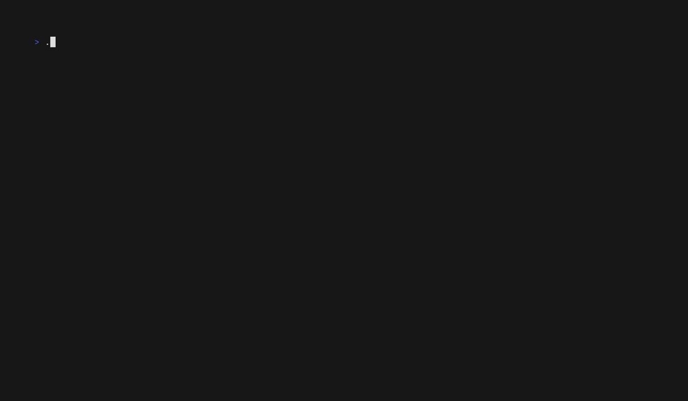

# Bubble Toast

Transient, non-blocking toast notifications for [Bubble Tea](https://github.com/charmbracelet/bubbletea) apps, styled with [Lip Gloss](https://github.com/charmbracelet/lipgloss).



Bubble Toast gives your TUI the familiar “web app toast” feel without blocking input or taking over the screen. Use it for background jobs, saves, sync status, warnings, undo prompts, and short-lived success/error feedback.

## Features

- Info, success, warning, error, and neutral Toast kinds
- Overlay placement: corners or centered at the top/bottom
- Timed, persistent, and progress-indicated Toast lifetimes
- Stable IDs for replacing long-running status Toasts
- Queueing with `+N more`, priority, overflow policies, and duplicate coalescing
- Keyboard actions like `[u] undo`
- Icons, ASCII/no-color/no-animation compatibility modes
- Renderer presets, custom themes, and full custom rendering

## Install

```sh
go get github.com/kevin-rieck/go-bubble-toast
```

## Quick start

```go
type model struct {
    toasts toast.Model
}

func (m model) Init() tea.Cmd {
    return toast.Show(toast.Info("ready", toast.WithTitle("App")))
}

func (m model) Update(msg tea.Msg) (tea.Model, tea.Cmd) {
    var cmd tea.Cmd
    m.toasts, cmd = m.toasts.Update(msg)
    return m, cmd
}

func (m model) View() string {
    return m.toasts.Overlay("your app view")
}
```

## Common patterns

Replace a long-running status Toast by ID:

```go
const syncStatus = "sync-status"

cmd := toast.Replace(syncStatus, toast.Info("syncing", toast.WithPersistent()))
cmd = toast.Replace(syncStatus, toast.Success("synced"))
```

Queue overflow, priority, and duplicate coalescing:

```go
m := toast.New(
    toast.WithMaxVisible(2),
    toast.WithKindPriority(toast.KindError, 10),
    toast.WithDuplicateCoalescing(),
)
```

Action Toasts:

```go
cmd := toast.Show(toast.Warning(
    "file deleted",
    toast.WithAction("u", "undo", func() tea.Msg { return undoDeleteMsg{} }),
))
```

Compatibility and custom rendering:

```go
m := toast.New(
    toast.WithASCIIOnly(),
    toast.WithNoColor(),
    toast.WithRendererPreset(toast.PresetIcon),
)
```

## Examples

```sh
go run ./examples/basic
go run ./examples/ergonomics
go run ./examples/interactive
```

The GIFs are recorded with [VHS](https://github.com/charmbracelet/vhs). The recording-only demo lives in `examples/gifdemo`.

## More demos

| Startup Toast | Toast stack | Progress bar |
| --- | --- | --- |
|  |  |  |

## Release

See [CHANGELOG.md](CHANGELOG.md) for release notes.
